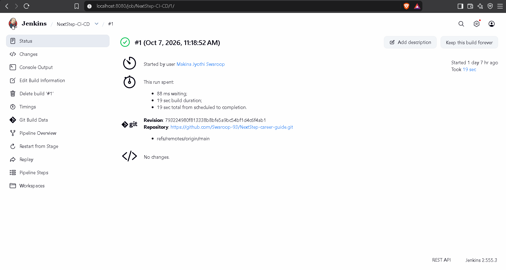
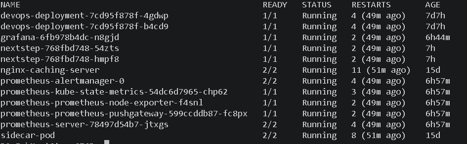
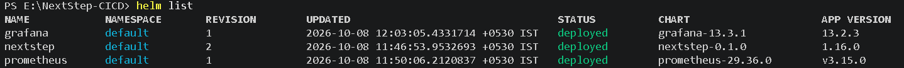
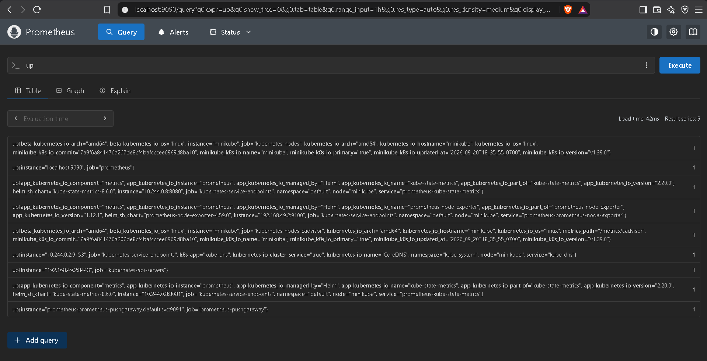
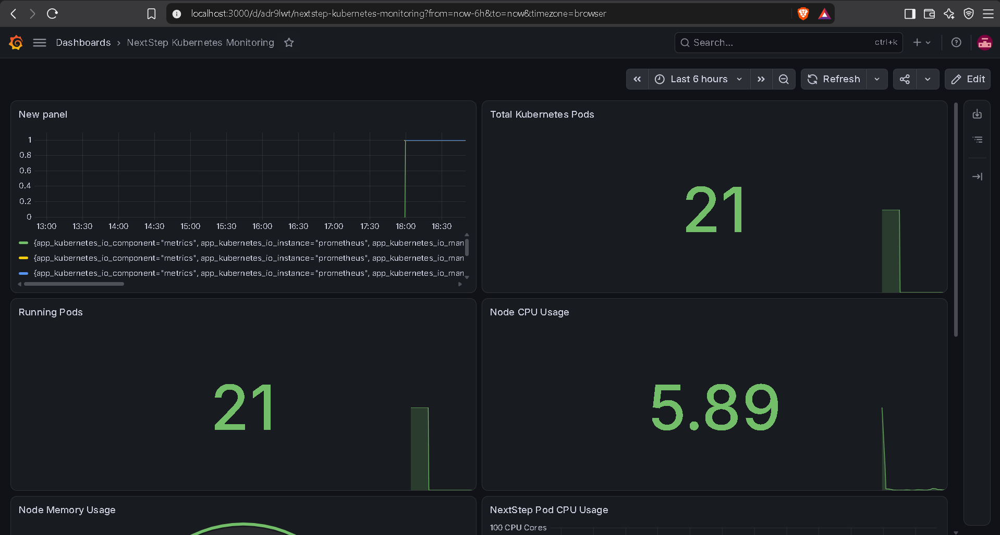

# 🚀 NextStep Career Guide — CI/CD, Kubernetes & Monitoring

A complete DevOps implementation of the **NextStep Career Guide** application using **Docker, Jenkins, Kubernetes, Helm, Prometheus, and Grafana**.

The project demonstrates how a web application can be containerized, automatically built and deployed through a CI/CD pipeline, managed using Kubernetes, packaged with Helm, and monitored using Prometheus and Grafana.

---

## 🏗️ Architecture

```text
                         ┌─────────────────────┐
                         │       GitHub        │
                         │   Source Repository │
                         └──────────┬──────────┘
                                    │
                                    ▼
                         ┌─────────────────────┐
                         │       Jenkins       │
                         │    CI/CD Pipeline   │
                         └──────────┬──────────┘
                                    │
                           Build / Test / Deploy
                                    │
                                    ▼
                         ┌─────────────────────┐
                         │       Docker        │
                         │   Container Image   │
                         └──────────┬──────────┘
                                    │
                                    ▼
                    ┌──────────────────────────────┐
                    │          Kubernetes          │
                    │                              │
                    │  ┌────────────────────────┐  │
                    │  │   NextStep Application │  │
                    │  │      2 Replicas        │  │
                    │  └────────────────────────┘  │
                    │                              │
                    │  ┌────────────────────────┐  │
                    │  │        Grafana          │  │
                    │  │      Dashboard          │  │
                    │  └────────────────────────┘  │
                    │                              │
                    │  ┌────────────────────────┐  │
                    │  │       Prometheus       │  │
                    │  │     Metrics Server     │  │
                    │  └────────────────────────┘  │
                    │                              │
                    └──────────────────────────────┘
```

---

## 🛠️ Technologies Used

| Technology | Purpose |
|------------|---------|
| HTML / CSS / JavaScript | NextStep Career Guide application |
| Git & GitHub | Source code management |
| Docker | Containerization |
| Jenkins | CI/CD automation |
| Kubernetes | Container orchestration |
| Minikube | Local Kubernetes cluster |
| Helm | Kubernetes package management |
| Prometheus | Application and Kubernetes monitoring |
| Grafana | Metrics visualization and dashboards |
| NGINX | Web server / application serving |

---

## 📂 Project Structure

```text
NextStep-Career-Guide/
│
├── index.html
├── style.css
├── script.js
├── Dockerfile
├── Jenkinsfile
├── deployment.yaml
├── README.md
│
├── nextstep/
│   ├── Chart.yaml
│   ├── values.yaml
│   ├── .helmignore
│   │
│   └── templates/
│       ├── deployment.yaml
│       ├── service.yaml
│       ├── serviceaccount.yaml
│       ├── ingress.yaml
│       ├── hpa.yaml
│       ├── httproute.yaml
│       ├── _helpers.tpl
│       ├── NOTES.txt
│       │
│       └── tests/
│           └── test-connection.yaml
│
└── screenshots/
    ├── nextstep-application.png
    ├── jenkins-pipeline.png
    ├── kubernetes-pods.png
    ├── helm-deployment.png
    ├── prometheus.png
    └── grafana-dashboard.png
```

---

# 🌐 NextStep Career Guide Application

NextStep is a career guidance web application designed to help users explore career-related information and opportunities.

The application is containerized using Docker and deployed into Kubernetes.

### Application Screenshot


---

# 🔄 CI/CD Pipeline

The project uses **Jenkins** to automate the application delivery process.

### Pipeline Flow

```text
Developer
    │
    ▼
GitHub
    │
    ▼
Jenkins
    │
    ├── Checkout Source Code
    │
    ├── Build Docker Image
    │
    ├── Run Application
    │
    └── Deploy to Kubernetes
    │
    ▼
Kubernetes
    │
    ▼
NextStep Application
```

### Jenkins Pipeline Screenshot



---

# 🐳 Docker

The application is packaged into a Docker container.

Docker provides a consistent environment for running the NextStep application across different systems.

### Dockerfile

The project contains a `Dockerfile` that defines how the application container is built.

```text
Source Code
     │
     ▼
 Dockerfile
     │
     ▼
Docker Image
     │
     ▼
Docker Container
```

---

# ☸️ Kubernetes Deployment

The application is deployed to a Kubernetes cluster using **Minikube**.

Kubernetes manages the application containers and ensures the desired number of replicas are running.

### Kubernetes Components

```text
Kubernetes Cluster
│
├── NextStep Deployment
│   └── 2 Application Pods
│
├── NextStep Service
│   └── NodePort
│
├── Grafana
│   └── Monitoring Dashboard
│
└── Prometheus
    ├── Prometheus Server
    ├── Alertmanager
    ├── Node Exporter
    └── Kube State Metrics
```

### Kubernetes Pods

The following Kubernetes components are running in the cluster:

```text
NextStep Application Pods
Grafana Pod
Prometheus Server
Prometheus Alertmanager
Kube State Metrics
Node Exporter
Pushgateway
NGINX / Supporting Services
```

### Kubernetes Pods Screenshot



---

# 📦 Helm Deployment

The NextStep application is packaged as a **Helm chart**.

Helm makes Kubernetes deployment easier by managing Kubernetes manifests as a reusable package.

### Helm Chart Structure

```text
nextstep/
│
├── Chart.yaml
├── values.yaml
├── .helmignore
│
└── templates/
    ├── deployment.yaml
    ├── service.yaml
    ├── serviceaccount.yaml
    ├── ingress.yaml
    ├── hpa.yaml
    ├── httproute.yaml
    ├── _helpers.tpl
    ├── NOTES.txt
    │
    └── tests/
        └── test-connection.yaml
```

### Helm Releases

The project contains the following Helm deployments:

```text
grafana
nextstep
prometheus
```

Example:

```bash
helm list
```

Expected result:

```text
NAME         NAMESPACE   STATUS
grafana      default     deployed
nextstep     default     deployed
prometheus   default     deployed
```

### Helm Deployment Screenshot



---

# 📊 Prometheus Monitoring

**Prometheus** is used to collect and store metrics from the Kubernetes environment.

The monitoring stack includes:

```text
Prometheus
│
├── Prometheus Server
├── Alertmanager
├── Node Exporter
├── Kube State Metrics
└── Pushgateway
```

Prometheus collects metrics related to Kubernetes resources and application infrastructure.

### Prometheus Screenshot



---

# 📈 Grafana Dashboard

**Grafana** is connected to Prometheus as the data source and is used to visualize Kubernetes metrics.

The dashboard provides visibility into:

- Kubernetes Pods
- Running Pods
- Total Pods
- Application metrics
- Prometheus metrics
- Cluster monitoring information

### Grafana Dashboard Screenshot



---

# 📊 Monitoring Dashboard

The project includes a custom Grafana dashboard:

```text
NextStep Kubernetes Monitoring
```

The dashboard contains panels such as:

```text
┌──────────────────────────────┐
│     Kubernetes Metrics       │
├──────────────────────────────┤
│                              │
│  Total Kubernetes Pods: 23   │
│                              │
└──────────────────────────────┘

┌──────────────────────────────┐
│       Running Pods           │
├──────────────────────────────┤
│                              │
│             23               │
│                              │
└──────────────────────────────┘
```

This provides a centralized view of the Kubernetes environment.

---

# 🔧 Kubernetes Commands Used

### Check Minikube

```bash
minikube status
```

### Start Minikube

```bash
minikube start
```

### Check Pods

```bash
kubectl get pods
```

### Check Services

```bash
kubectl get services
```

### Check Deployments

```bash
kubectl get deployments
```

### Check Helm Releases

```bash
helm list
```

### Access NextStep Application

```bash
minikube service nextstep
```

### Access Grafana

```bash
kubectl port-forward service/grafana 3000:80
```

Then open:

```text
http://localhost:3000
```

---

# 🚀 Helm Commands

### Install NextStep

```bash
helm install nextstep ./nextstep
```

### Upgrade NextStep

```bash
helm upgrade nextstep ./nextstep
```

### Check Helm Releases

```bash
helm list
```

### Check Helm Status

```bash
helm status nextstep
```

### Uninstall

```bash
helm uninstall nextstep
```

---

# 🔍 Useful Kubernetes Troubleshooting Commands

### View Pod Status

```bash
kubectl get pods
```

### View Detailed Pod Information

```bash
kubectl describe pod <pod-name>
```

### View Application Logs

```bash
kubectl logs <pod-name>
```

### View Deployment Status

```bash
kubectl get deployments
```

### View Services

```bash
kubectl get services
```

### View All Resources

```bash
kubectl get all
```

---

# 📁 Kubernetes Resources

The project uses Kubernetes resources including:

```text
Deployment
Service
ServiceAccount
Ingress
HorizontalPodAutoscaler
Config / Helm Values
```

---

# 🔐 Monitoring Architecture

```text
              Kubernetes Cluster
                     │
          ┌──────────┴──────────┐
          │                     │
          ▼                     ▼
   NextStep Pods           Kubernetes Metrics
          │                     │
          │              Kube State Metrics
          │                     │
          └──────────┬──────────┘
                     ▼
                Prometheus
                     │
                     ▼
                  Grafana
                     │
                     ▼
             Monitoring Dashboard
```

---

# 🎯 Project Objectives

The main objectives of this project are:

- Build a real-world DevOps workflow
- Containerize a web application using Docker
- Automate deployment using Jenkins
- Deploy applications using Kubernetes
- Package Kubernetes resources using Helm
- Monitor Kubernetes workloads using Prometheus
- Visualize metrics using Grafana
- Understand CI/CD and cloud-native deployment practices
- Implement basic observability for an application

---

# 💡 Key DevOps Concepts Demonstrated

```text
✅ Git & GitHub
✅ Source Code Management
✅ Docker Containerization
✅ CI/CD
✅ Jenkins
✅ Kubernetes
✅ Minikube
✅ Helm
✅ Kubernetes Deployments
✅ Kubernetes Services
✅ Prometheus
✅ Grafana
✅ Monitoring
✅ Observability
```

---

# 🏆 Project Outcome

The completed project demonstrates an end-to-end DevOps workflow:

```text
Developer
    │
    ▼
GitHub
    │
    ▼
Jenkins CI/CD
    │
    ▼
Docker
    │
    ▼
Kubernetes
    │
    ├───────────────┐
    ▼               ▼
NextStep         Monitoring
Application          │
    │                │
    │          ┌─────┴─────┐
    │          ▼           ▼
    │     Prometheus    Grafana
    │          │           │
    └──────────┴───────────┘
                │
                ▼
        Kubernetes Monitoring
```

---

# 📸 Project Screenshots

## 1️⃣ NextStep Application


## 2️⃣ Jenkins CI/CD Pipeline


## 3️⃣ Kubernetes Pods


## 4️⃣ Helm Deployment


## 5️⃣ Prometheus


## 6️⃣ Grafana Dashboard


---

# 📌 Project Summary

**NextStep Career Guide** is a DevOps-focused project demonstrating how a web application can be developed, containerized, continuously deployed, orchestrated, and monitored using modern DevOps tools.

The project brings together:

**GitHub → Jenkins → Docker → Kubernetes → Helm → Prometheus → Grafana**

This project demonstrates practical knowledge of **CI/CD, containerization, Kubernetes orchestration, Helm deployments, monitoring, and observability**.

---

# 👨‍💻 Author

**Swaroop**

GitHub:  
https://github.com/Swaroop-93/NextStep-career-guide

---

# ⭐ If you found this project useful

Feel free to ⭐ the repository and explore the implementation.
